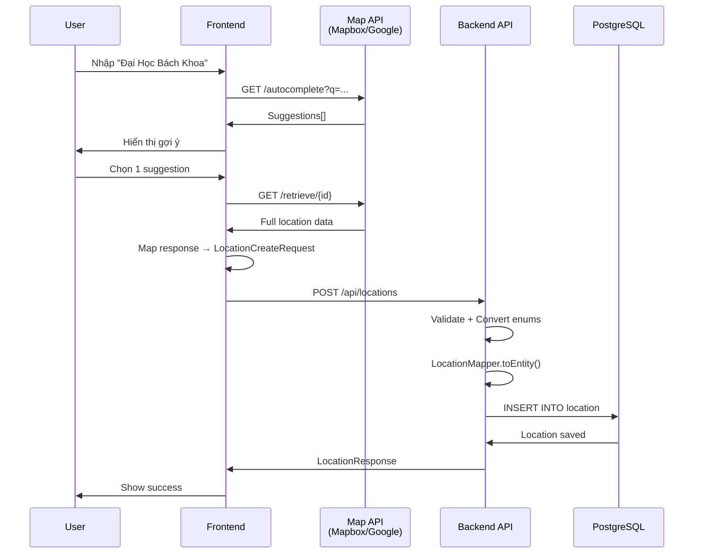

# 📍 TripJoy - Location Module & Map API Integration Guide

> **Tài liệu hướng dẫn chi tiết về PostGIS, Location Entity và tích hợp Map API**

---

## 📚 Mục lục

1. [Tổng quan PostGIS](#1-tổng-quan-postgis)
2. [Location Entity Redesign](#2-location-entity-redesign)
3. [Map API Integration](#3-map-api-integration)
4. [Data Flow: Client ↔ Backend](#4-data-flow-client--backend)
5. [Implementation Guide](#5-implementation-guide)
6. [Code Examples](#6-code-examples)

---

## 1. Tổng quan PostGIS

### 1.1. PostGIS là gì?

**PostGIS** là extension của PostgreSQL cho phép làm việc với **dữ liệu địa lý (Geographic/Spatial Data)**.

#### Lợi ích chính:

✅ **Lưu trữ tọa độ hiệu quả** bằng kiểu dữ liệu `geometry` hoặc `geography`  
✅ **Tìm kiếm không gian (Spatial Queries)**: tìm địa điểm gần nhất, trong bán kính, ...  
✅ **Indexing mạnh mẽ** với GiST/SP-GiST indexes → truy vấn cực nhanh  
✅ **Tính toán khoảng cách** chính xác (km, m) giữa 2 điểm  
✅ **Chuẩn OGC** (Open Geospatial Consortium) - tương thích với mọi GIS tool

### 1.2. PostGIS vs Latitude/Longitude thường

| Tiêu chí | Latitude/Longitude (Double) | PostGIS Geometry |
|----------|----------------------------|------------------|
| **Lưu trữ** | 2 cột riêng (lat, lng) | 1 cột duy nhất `Point` |
| **Tìm kiếm gần nhất** | ❌ Phải dùng Haversine formula phức tạp | ✅ `ST_Distance()` built-in |
| **Index** | ⚠️ Composite index thông thường | ✅ GiST spatial index (SIÊU NHANH) |
| **Tìm trong vùng** | ❌ Phức tạp, chậm | ✅ `ST_DWithin()`, `ST_Contains()` |
| **Performance** | Chậm khi có nhiều data | Rất nhanh ngay cả millions records |

### 1.3. Cấu trúc PostGIS Point

```sql
-- Kiểu dữ liệu PostGIS Point (SRID 4326 = WGS84 - GPS standard)
geometry(Point, 4326)

-- Ví dụ: Tọa độ Đại Học Bách Khoa TP.HCM
POINT(106.65976722 10.77324709)
       ↑           ↑
    longitude   latitude
```

> ⚠️ **LƯU Ý**: PostGIS format là `(longitude, latitude)` - **NGƯỢC** với thông thường!

### 1.4. Ví dụ Spatial Queries

```sql
-- 1. Tìm địa điểm trong bán kính 5km
SELECT * FROM location 
WHERE ST_DWithin(
  coordinates::geography,
  ST_SetSRID(ST_MakePoint(106.660172, 10.772461), 4326)::geography,
  5000  -- 5000 meters = 5km
);

-- 2. Tính khoảng cách giữa 2 điểm (đơn vị: meters)
SELECT ST_Distance(
  coordinates::geography,
  ST_SetSRID(ST_MakePoint(106.660172, 10.772461), 4326)::geography
) as distance_meters
FROM location;

-- 3. Tìm 10 địa điểm gần nhất
SELECT *, 
  ST_Distance(
    coordinates::geography,
    ST_SetSRID(ST_MakePoint(106.660172, 10.772461), 4326)::geography
  ) as distance
FROM location
ORDER BY coordinates <-> ST_SetSRID(ST_MakePoint(106.660172, 10.772461), 4326)
LIMIT 10;
```

---

## 2. Location Entity Redesign

### 2.1. So sánh Cũ vs Mới

#### **Trước đây (Old Design):**

```
Location (chỉ có id, name, latitude, longitude)
    ↓ 1-1
LocationInfo (mô tả, ảnh, rating, reviews, ...)
```

❌ **Vấn đề:**
- Phải JOIN 2 tables mỗi lần query → chậm
- Thiếu thông tin từ Map API (provider, địa chỉ cấu trúc, POI categories, ...)
- Không hỗ trợ nhiều Map Provider
- Không có PostGIS cho spatial queries

#### **Bây giờ (New Design):**

```
Location (ALL IN ONE - không còn LocationInfo)
  ├─ Provider Info (Mapbox, Google Maps, Manual)
  ├─ Coordinates (PostGIS Point + fallback lat/lng)
  ├─ Address Components (embedded - structured address)
  ├─ POI Categories & Maki Icons
  ├─ Operational Status (ACTIVE, CLOSED, ...)
  └─ Raw JSON Response (backup từ Map API)
```

✅ **Lợi ích:**
- Single table → query nhanh
- Đầy đủ thông tin từ Map API
- Hỗ trợ nhiều provider (Mapbox, Google Maps)
- PostGIS ready (hiện tại comment out, dễ enable)
- Structured address cho search nâng cao

### 2.2. Chi tiết các Field Groups

#### **A. Provider Information**

```java
@Enumerated(EnumType.STRING)
private MapProvider provider; // MAPBOX | GOOGLE_MAPS | MANUAL

private String providerId; // mapbox_id hoặc place_id (unique)
```

**Mục đích:**
- Track nguồn dữ liệu (từ Mapbox, Google Maps, hay user nhập tay)
- `providerId` để tránh duplicate và sync lại với Map API sau này

---

#### **B. Coordinates (Fallback hiện tại - PostGIS sẵn sàng)**

```java
// Hiện tại ĐANG DÙNG (PostGIS comment out)
@Column(nullable = false)
private Double latitude;   // 10.77324709

@Column(nullable = false)
private Double longitude;  // 106.65976722

// PostGIS (READY - chờ enable)
// @Column(columnDefinition = "geometry(Point,4326)")
// private Point coordinates;  // POINT(106.659 10.773)
```

**Routable Coordinates:**
```java
private Double routableLatitude;   // Điểm vào đường (cho navigation)
private Double routableLongitude;  // Khác với tọa độ chính của POI
```

**Giải thích:**
- **Main coordinates**: Tọa độ chính xác của địa điểm (trung tâm building)
- **Routable coordinates**: Điểm gần nhất trên đường để xe đến được
- Ví dụ: Bách Khoa main = cổng chính, routable = lối vào từ Lý Thường Kiệt

---

#### **C. Address Components (Embedded - KHÔNG phải foreign key)**

```java
@Embedded
private AddressComponents addressComponents;
```

**Cấu trúc `AddressComponents`:**

```java
@Embeddable
public class AddressComponents {
    private String countryName;    // "Vietnam"
    private String countryCode;    // "VN" hoặc "VNM"
    private String city;           // "Ho Chi Minh City"
    private String district;       // "District 10"
    private String ward;           // "Ward 14"
    private String streetName;     // "đ. lý thường kiệt"
    private String addressNumber;  // "268"
    private String postcode;       // "72500"
}
```

**Tại sao Embedded?**
- Tất cả lưu trong **CÙNG 1 TABLE** `location`
- Không cần JOIN
- Dễ search theo city, district, ...

---

#### **D. POI Categories & UI**

```java
@Convert(converter = StringListConverter.class)
private List<String> poiCategories;  // ["education", "university"]

private String maki;  // "school" (icon name từ Mapbox)
```

**StringListConverter:**
- Convert `List<String>` ↔ `TEXT` trong DB
- Lưu dạng comma-separated: `"education,university,landmark"`

**Maki Icons:**
- Mapbox cung cấp icon names (school, restaurant, hotel, ...)
- Frontend dùng để hiển thị icon phù hợp

---

#### **E. Operational Status**

```java
@Enumerated(EnumType.STRING)
private OperationalStatus operationalStatus;

public enum OperationalStatus {
    ACTIVE,               // Đang hoạt động
    CLOSED,               // Tạm đóng cửa
    TEMPORARILY_CLOSED,   // Đóng cửa tạm thời
    PERMANENTLY_CLOSED,   // Đóng cửa vĩnh viễn
    UNKNOWN               // Không rõ
}
```

---

#### **F. Raw Response Backup**

```java
@Column(columnDefinition = "JSONB")
private String rawResponse; // Full JSON từ Map API
```

**Mục đích:**
- Backup toàn bộ response từ Mapbox/Google Maps
- Lưu dạng JSONB trong PostgreSQL → queryable
- Dùng để extract thêm thông tin sau này nếu cần

---

### 2.3. Database Schema (sau khi Hibernate tạo)

```sql
CREATE TABLE location (
    -- Base Entity
    id UUID PRIMARY KEY,
    created_at TIMESTAMP,
    updated_at TIMESTAMP,
    created_by UUID,
    updated_by UUID,
    
    -- Provider
    provider VARCHAR(20) CHECK (provider IN ('MAPBOX','GOOGLE_MAPS','MANUAL')),
    provider_id VARCHAR(255) UNIQUE,
    
    -- Basic Info
    name VARCHAR(500) NOT NULL,
    full_address TEXT,
    place_formatted TEXT,
    
    -- Coordinates (hiện tại)
    latitude FLOAT NOT NULL,
    longitude FLOAT NOT NULL,
    routable_latitude FLOAT,
    routable_longitude FLOAT,
    
    -- PostGIS (ready - chờ uncomment)
    -- coordinates geometry(Point,4326),
    
    -- Address Components (EMBEDDED - cùng table!)
    country_name VARCHAR(100),
    country_code VARCHAR(3),
    city VARCHAR(100),
    district VARCHAR(100),
    ward VARCHAR(100),
    street_name VARCHAR(200),
    address_number VARCHAR(20),
    postcode VARCHAR(20),
    
    -- POI & UI
    poi_categories TEXT,  -- StringListConverter
    maki VARCHAR(50),
    
    -- Operational
    hotline VARCHAR(50),
    is_open BOOLEAN,
    operational_status VARCHAR(30),
    wheelchair_accessible BOOLEAN,
    
    -- Backup
    raw_response JSONB
);

-- Indexes
CREATE INDEX idx_location_provider_id ON location(provider_id);
CREATE INDEX idx_location_coordinates ON location(latitude, longitude);
-- CREATE INDEX idx_location_postgis ON location USING GIST(coordinates);  -- PostGIS index
```

---

## 3. Map API Integration

### 3.1. Mapbox vs Google Maps

| Feature | Mapbox | Google Maps |
|---------|--------|-------------|
| **API** | Geocoding, Search | Places, Geocoding |
| **Response Format** | GeoJSON | Custom JSON |
| **Pricing** | Free tier: 100K requests/month | Free tier: Ít hơn |
| **Data Quality** | Tốt (global) | Xuất sắc (VN) |
| **Icons** | Maki icons | Custom |

### 3.2. Mapbox Integration Flow

#### **Step 1: Client gọi Mapbox Autocomplete**

```javascript
// Frontend (React/Vue)
const searchLocations = async (query) => {
  const response = await fetch(
    `https://api.mapbox.com/search/searchbox/v1/suggest?` +
    `q=${query}&` +
    `access_token=${MAPBOX_TOKEN}&` +
    `language=vi&` +
    `country=VN&` +
    `types=poi,address`
  );
  
  const data = await response.json();
  // data.suggestions = array of suggestions
  return data.suggestions;
};
```

#### **Step 2: User chọn 1 suggestion → Get full details**

```javascript
const getLocationDetails = async (mapboxId) => {
  const response = await fetch(
    `https://api.mapbox.com/search/searchbox/v1/retrieve/${mapboxId}?` +
    `access_token=${MAPBOX_TOKEN}`
  );
  
  const data = await response.json();
  return data.features[0]; // Full location data
};
```

#### **Step 3: Map Mapbox Response → LocationCreateRequest**

```javascript
const mapboxToRequest = (feature) => {
  const props = feature.properties;
  const coords = feature.geometry.coordinates; // [lng, lat]
  
  return {
    provider: "MAPBOX",
    provider_id: props.mapbox_id,
    name: props.name,
    latitude: coords[1],  // ⚠️ Mapbox returns [lng, lat]
    longitude: coords[0],
    full_address: props.full_address,
    place_formatted: props.place_formatted,
    address_components: {
      country_name: props.context?.country?.name,
      country_code: props.context?.country?.country_code,
      city: props.context?.place?.name,
      district: props.context?.district?.name,
      ward: props.context?.neighborhood?.name,
      street_name: props.context?.street?.name,
      address_number: props.context?.address?.address_number,
      postcode: props.context?.postcode?.name
    },
    poi_categories: props.poi_category_ids || [],
    maki: props.maki,
    routable_latitude: coords[1], // Mapbox ko có routable point riêng
    routable_longitude: coords[0],
    operational_status: props.operational_status?.toUpperCase() || "UNKNOWN",
    raw_map_response: JSON.stringify(feature) // Backup full data
  };
};
```

#### **Step 4: Gửi lên Backend**

```javascript
const createLocation = async (locationData) => {
  const response = await fetch('http://localhost:8080/api/locations', {
    method: 'POST',
    headers: {
      'Content-Type': 'application/json',
      'Authorization': `Bearer ${token}`
    },
    body: JSON.stringify(locationData)
  });
  
  return await response.json();
};
```

### 3.3. Google Maps Integration (tương tự)

```javascript
// Google Places Autocomplete
const searchGooglePlaces = async (query) => {
  const response = await fetch(
    `https://maps.googleapis.com/maps/api/place/autocomplete/json?` +
    `input=${query}&` +
    `key=${GOOGLE_API_KEY}&` +
    `language=vi&` +
    `components=country:vn`
  );
  
  const data = await response.json();
  return data.predictions;
};

// Get Place Details
const getPlaceDetails = async (placeId) => {
  const response = await fetch(
    `https://maps.googleapis.com/maps/api/place/details/json?` +
    `place_id=${placeId}&` +
    `key=${GOOGLE_API_KEY}&` +
    `fields=name,geometry,formatted_address,address_components,types`
  );
  
  const data = await response.json();
  return data.result;
};
```

---

## 4. Data Flow: Client ↔ Backend

### 4.1. Luồng tạo Location



### 4.2. Detailed Backend Flow

```
1. Controller nhận LocationCreateRequest
   ↓
2. @Valid validation (NotNull, NotBlank, ...)
   ↓
3. LocationService.createLocation()
   ├─ Check duplicate by providerId
   ├─ LocationMapper.toEntity()
   │  ├─ Convert provider String → MapProvider enum
   │  ├─ Convert status String → OperationalStatus enum
   │  ├─ Map AddressComponentsDto → AddressComponents
   │  └─ (Future: createPoint() for PostGIS)
   ├─ LocationRepository.save()
   └─ LocationMapper.toResponse()
   ↓
4. Return LocationResponse to client
```

---

## 5. Implementation Guide

### 5.1. Implement LocationController

```java
@RestController
@RequestMapping("/api/locations")
@RequiredArgsConstructor
public class LocationController {
    
    private final LocationService locationService;
    
    @PostMapping
    public ResponseEntity<BaseResponse<LocationResponse>> create(
        @Valid @RequestBody LocationCreateRequest request
    ) {
        LocationResponse response = locationService.createLocation(request);
        return ResponseEntity.ok(BaseResponse.success(response));
    }
    
    @GetMapping("/{id}")
    public ResponseEntity<BaseResponse<LocationResponse>> getById(
        @PathVariable UUID id
    ) {
        LocationResponse response = locationService.getLocationById(id);
        return ResponseEntity.ok(BaseResponse.success(response));
    }
    
    @GetMapping("/search")
    public ResponseEntity<BaseResponse<List<LocationResponse>>> search(
        @RequestParam String query,
        @RequestParam(required = false) String city,
        @RequestParam(required = false) String district
    ) {
        List<LocationResponse> results = locationService.searchLocations(query, city, district);
        return ResponseEntity.ok(BaseResponse.success(results));
    }
    
    // PostGIS: Tìm locations gần nhất (khi enable PostGIS)
    @GetMapping("/nearby")
    public ResponseEntity<BaseResponse<List<LocationResponse>>> getNearby(
        @RequestParam Double latitude,
        @RequestParam Double longitude,
        @RequestParam(defaultValue = "5000") Integer radiusMeters
    ) {
        List<LocationResponse> results = locationService.findNearby(latitude, longitude, radiusMeters);
        return ResponseEntity.ok(BaseResponse.success(results));
    }
}
```

### 5.2. Implement LocationService

```java
@Service
@RequiredArgsConstructor
public class LocationService {
    
    private final LocationRepository locationRepository;
    private final LocationMapper locationMapper;
    
    public LocationResponse createLocation(LocationCreateRequest request) {
        // Check duplicate by providerId
        if (request.getProviderId() != null) {
            locationRepository.findByProviderId(request.getProviderId())
                .ifPresent(existing -> {
                    throw new AppException(ErrorCode.LOCATION_ALREADY_EXISTS);
                });
        }
        
        // Map DTO → Entity
        Location location = locationMapper.toEntity(request);
        
        // Save
        Location saved = locationRepository.save(location);
        
        // Entity → Response DTO
        return locationMapper.toResponse(saved);
    }
    
    public LocationResponse getLocationById(UUID id) {
        Location location = locationRepository.findById(id)
            .orElseThrow(() -> new AppException(ErrorCode.LOCATION_NOT_FOUND));
        
        return locationMapper.toResponse(location);
    }
    
    public List<LocationResponse> searchLocations(String query, String city, String district) {
        List<Location> locations = locationRepository.searchByNameAndAddress(query, city, district);
        return locations.stream()
            .map(locationMapper::toResponse)
            .toList();
    }
    
    // PostGIS method (khi enable)
    // public List<LocationResponse> findNearby(Double lat, Double lng, Integer radius) {
    //     Point point = locationMapper.createPoint(lng, lat);
    //     List<Location> locations = locationRepository.findNearby(point, radius);
    //     return locations.stream().map(locationMapper::toResponse).toList();
    // }
}
```

### 5.3. Implement LocationRepository

```java
@Repository
public interface LocationRepository extends JpaRepository<Location, UUID> {
    
    Optional<Location> findByProviderId(String providerId);
    
    @Query("""
        SELECT l FROM Location l 
        WHERE (:query IS NULL OR LOWER(l.name) LIKE LOWER(CONCAT('%', :query, '%')))
          AND (:city IS NULL OR LOWER(l.addressComponents.city) = LOWER(:city))
          AND (:district IS NULL OR LOWER(l.addressComponents.district) = LOWER(:district))
        """)
    List<Location> searchByNameAndAddress(
        @Param("query") String query,
        @Param("city") String city,
        @Param("district") String district
    );
    
    // PostGIS queries (khi enable)
    /*
    @Query(value = """
        SELECT * FROM location 
        WHERE ST_DWithin(
          coordinates::geography,
          ST_SetSRID(:point, 4326)::geography,
          :radiusMeters
        )
        ORDER BY coordinates <-> :point
        LIMIT 50
        """, nativeQuery = true)
    List<Location> findNearby(@Param("point") Point point, @Param("radiusMeters") Integer radiusMeters);
    */
}
```

---

## 6. Code Examples

### 6.1. Frontend: Complete Mapbox Integration

```javascript
// LocationPicker.jsx
import React, { useState } from 'react';

const LocationPicker = ({ onLocationSelected }) => {
  const [query, setQuery] = useState('');
  const [suggestions, setSuggestions] = useState([]);
  const [loading, setLoading] = useState(false);
  
  const MAPBOX_TOKEN = 'pk.your_mapbox_token_here';
  
  // Autocomplete search
  const handleSearch = async (value) => {
    setQuery(value);
    
    if (value.length < 3) {
      setSuggestions([]);
      return;
    }
    
    setLoading(true);
    try {
      const res = await fetch(
        `https://api.mapbox.com/search/searchbox/v1/suggest?` +
        `q=${encodeURIComponent(value)}&` +
        `access_token=${MAPBOX_TOKEN}&` +
        `language=vi&` +
        `country=VN&` +
        `types=poi,address&` +
        `limit=10`
      );
      
      const data = await res.json();
      setSuggestions(data.suggestions || []);
    } catch (error) {
      console.error('Mapbox error:', error);
    } finally {
      setLoading(false);
    }
  };
  
  // Get full details when user selects
  const handleSelect = async (suggestion) => {
    try {
      const res = await fetch(
        `https://api.mapbox.com/search/searchbox/v1/retrieve/${suggestion.mapbox_id}?` +
        `access_token=${MAPBOX_TOKEN}`
      );
      
      const data = await res.json();
      const feature = data.features[0];
      
      // Map to LocationCreateRequest
      const locationData = mapMapboxToRequest(feature);
      
      // Send to backend
      await createLocationOnBackend(locationData);
      
      // Notify parent
      onLocationSelected(locationData);
    } catch (error) {
      console.error('Error:', error);
    }
  };
  
  const mapMapboxToRequest = (feature) => {
    const props = feature.properties;
    const coords = feature.geometry.coordinates;
    
    return {
      provider: "MAPBOX",
      provider_id: props.mapbox_id,
      name: props.name,
      latitude: coords[1],
      longitude: coords[0],
      full_address: props.full_address,
      place_formatted: props.place_formatted,
      address_components: {
        countryName: props.context?.country?.name,
        countryCode: props.context?.country?.country_code,
        city: props.context?.place?.name,
        district: props.context?.district?.name,
        ward: props.context?.neighborhood?.name,
        streetName: props.context?.street?.name,
        addressNumber: props.context?.address?.address_number,
        postcode: props.context?.postcode?.name
      },
      poiCategories: props.poi_category_ids || [],
      maki: props.maki,
      routable_latitude: coords[1],
      routable_longitude: coords[0],
      operational_status: props.operational_status?.toUpperCase() || "UNKNOWN",
      raw_map_response: JSON.stringify(feature)
    };
  };
  
  const createLocationOnBackend = async (locationData) => {
    const token = localStorage.getItem('auth_token');
    
    const res = await fetch('http://localhost:8080/api/locations', {
      method: 'POST',
      headers: {
        'Content-Type': 'application/json',
        'Authorization': `Bearer ${token}`
      },
      body: JSON.stringify(locationData)
    });
    
    if (!res.ok) {
      throw new Error('Failed to create location');
    }
    
    return await res.json();
  };
  
  return (
    <div>
      <input 
        type="text"
        value={query}
        onChange={(e) => handleSearch(e.target.value)}
        placeholder="Tìm địa điểm..."
      />
      
      {loading && <div>Đang tìm...</div>}
      
      {suggestions.length > 0 && (
        <ul>
          {suggestions.map((s) => (
            <li key={s.mapbox_id} onClick={() => handleSelect(s)}>
              <strong>{s.name}</strong>
              <br />
              <small>{s.place_formatted}</small>
            </li>
          ))}
        </ul>
      )}
    </div>
  );
};

export default LocationPicker;
```

### 6.2. Backend: Enable PostGIS (Future)

**Khi muốn enable PostGIS:**

**Step 1:** Uncomment code trong `Location.java`

```java
// Uncomment line 10
import org.locationtech.jts.geom.Point;

// Uncomment lines 58-59
@Column(name = "coordinates", columnDefinition = "geometry(Point,4326)")
private Point coordinates;
```

**Step 2:** Uncomment code trong `LocationMapper.java`

```java
// Uncomment imports (lines 12-15)
import org.locationtech.jts.geom.Coordinate;
import org.locationtech.jts.geom.GeometryFactory;
import org.locationtech.jts.geom.Point;
import org.locationtech.jts.geom.PrecisionModel;

// Uncomment GeometryFactory (line 24)
GeometryFactory geometryFactory = new GeometryFactory(new PrecisionModel(), 4326);

// Uncomment mapping (line 35)
@Mapping(target = "coordinates", expression = "java(createPoint(request.getLongitude(), request.getLatitude()))")

// Uncomment method (lines 66-72)
default Point createPoint(Double lng, Double lat) {
    if (lat == null || lng == null) {
        return null;
    }
    return geometryFactory.createPoint(new Coordinate(lng, lat));
}
```

**Step 3:** Restart app → Hibernate sẽ tự tạo column `coordinates geometry(Point,4326)`

**Step 4:** Tạo GiST Index cho performance

```sql
CREATE INDEX idx_location_postgis 
ON location USING GIST(coordinates);
```

**Step 5:** Dùng spatial queries

```java
@Query(value = """
    SELECT * FROM location 
    WHERE ST_DWithin(
      coordinates::geography,
      ST_SetSRID(ST_MakePoint(:lng, :lat), 4326)::geography,
      :radiusMeters
    )
    ORDER BY coordinates <-> ST_SetSRID(ST_MakePoint(:lng, :lat), 4326)
    LIMIT :limit
    """, nativeQuery = true)
List<Location> findNearby(
    @Param("lat") Double lat,
    @Param("lng") Double lng,
    @Param("radiusMeters") Integer radiusMeters,
    @Param("limit") Integer limit
);
```

---

## 🎯 Tóm tắt

### ✅ Đã hoàn thành:

1. ✅ **Location Entity redesign** - Merge LocationInfo vào Location
2. ✅ **Map API ready** - Cấu trúc field hỗ trợ Mapbox & Google Maps
3. ✅ **PostGIS ready** - Code sẵn sàng, chỉ cần uncomment
4. ✅ **LocationMapper** - Convert DTO ↔ Entity với enum converters
5. ✅ **Database schema** - Hibernate đã tạo table đúng

### 🚀 Next Steps để implement:

1. **LocationController** - Tạo REST API endpoints
2. **LocationService** - Business logic
3. **LocationRepository** - Custom queries
4. **Frontend Integration** - Tích hợp Mapbox/Google Maps autocomplete
5. **Testing** - Test với real Map API data
6. **(Optional) Enable PostGIS** - Uncomment code khi cần spatial queries

---

## 📞 Hỗ trợ

Nếu cần giải thích thêm hoặc code examples cụ thể, hãy hỏi chi tiết phần nào! 🚀
