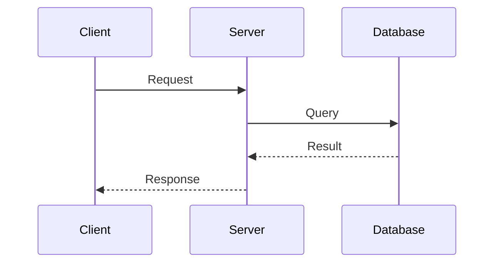

# TripJoy API Documentation

> Comprehensive documentation for TripJoy Backend API

## 📚 Available Documentation

### 🔐 Security & Authentication
- **[Spring Security với JWT](./spring-security-jwt.md)** - Chi tiết về JWT access token, refresh token, authentication flow và security configuration

### 🏗️ Architecture & Design
- **[Architecture Overview (Vietnamese)](./ARCHITECTURE_VI.md)** - Kiến trúc tổng quan của hệ thống
- **[Technical Report: Socket.IO](./TECHNICAL_REPORT_SOCKET_IO.md)** - Báo cáo kỹ thuật về WebSocket implementation

### 📡 Real-time Communication
- **[Socket.IO Guide (Vietnamese)](./SOCKET_IO_README_VI.md)** - Hướng dẫn chi tiết Socket.IO cho chat và notifications
- **[Notification System Guide](./NOTIFICATION_SYSTEM_GUIDE.md)** - Hệ thống thông báo real-time

### 🗺️ Features
- **[Location & Map API Guide](./LOCATION_MAP_API_GUIDE.md)** - Tích hợp Google Maps, geocoding, và location services
- **[Cursor-Based Pagination](./CURSOR_BASED_PAGINATION.md)** - Hướng dẫn phân trang hiệu năng cao
- **[Database Indexing](./DATABASE_INDEXING.md)** - Tối ưu database performance với indexes

---

## 🚀 Quick Start

### Prerequisites
- Java 21+ 
- PostgreSQL 17 with PostGIS
- Redis 7.2+
- Maven 3.8+

### Environment Setup

1. **Copy environment template:**
   ```bash
   cp .env.example .env
   ```

2. **Configure `.env`:**
   ```properties
   # Database
   DB_HOST=localhost
   DB_PORT=5433
   DB_NAME=tripjoy
   DB_USERNAME=tripjoyuser
   DB_PASSWORD=TripJoyPass2025
   
   # JWT (IMPORTANT: Change in production!)
   JWT_SIGNER_KEY=your-secret-key-here
   JWT_EXPIRATION=3600          # 1 hour
   JWT_REFRESH_EXPIRATION=360000 # ~4 days
   
   # Redis
   REDIS_HOST=localhost
   REDIS_PORT=6379
   REDIS_PASSWORD=TripJoySecurePass2025
   ```

3. **Run with Docker:**
   ```bash
   docker-compose up -d
   ```

4. **Run application:**
   ```bash
   ./mvnw spring-boot:run
   ```

5. **Access Swagger UI:**
   ```
   http://localhost:8080/swagger-ui/index.html
   ```

---

## 📖 Documentation Conventions

### Code Examples

**Java:**
```java
// Use full class names in first mention
import com.tripjoy.api.service.impl.AuthenticationService;

// Prefer builder pattern
var response = AuthenticationResponse.builder()
        .accessToken(token)
        .refreshToken(refreshToken)
        .build();
```

**API Requests:**
```http
POST /api/v1/auth/login HTTP/1.1
Host: localhost:8080
Content-Type: application/json

{
  "username": "user1",
  "password": "Password123!"
}
```

**Response Format:**
```json
{
  "code": 1000,
  "message": "Success",
  "data": {
    "access_token": "eyJ...",
    "refresh_token": "eyJ...",
    "expires_in": 3600
  }
}
```

### Diagrams

We use **Mermaid** for diagrams:



---

## 🔧 Tech Stack

### Backend Framework
- **Spring Boot 3.3.9**
  - Spring Security 6.3.7
  - Spring Data JPA
  - Spring WebSocket

### Database
- **PostgreSQL 17** with PostGIS extension
- **Redis 7.2** for caching & real-time

### Libraries
- **Nimbus JOSE+JWT** - JWT implementation
- **MapStruct** - DTO mapping
- **Lombok** - Reduce boilerplate
- **Socket.IO Java** - WebSocket server

### Tools
- **Maven** - Build tool
- **Docker** - Containerization
- **Swagger/OpenAPI** - API documentation

---

## 📂 Project Structure

```
tripjoy-api/
├── src/main/java/com/tripjoy/api/
│   ├── configuration/
│   │   └── security/           # Security configs, JWT utils
│   ├── controller/             # REST endpoints
│   ├── service/                # Business logic
│   ├── repository/             # Data access
│   ├── entity/                 # JPA entities
│   ├── dto/                    # Request/Response DTOs
│   ├── mapper/                 # MapStruct mappers
│   ├── exception/              # Exception handling
│   ├── listener/               # Event listeners
│   └── constant/               # Constants & enums
│
├── src/main/resources/
│   ├── application.yml         # Main config
│   └── application-dev.yml     # Dev profile
│
├── docs/                       # 📚 Documentation (you are here!)
├── docker-compose.yml          # Docker services
└── pom.xml                     # Maven dependencies
```

---

## 🧪 Testing

### Manual Testing with cURL

**Login:**
```bash
curl -X POST http://localhost:8080/api/v1/auth/login \
  -H "Content-Type: application/json" \
  -d '{"username": "user1", "password": "Password123!"}' | jq
```

**API Call with Token:**
```bash
TOKEN="your_access_token"
curl -X GET http://localhost:8080/api/v1/groups \
  -H "Authorization: Bearer $TOKEN" | jq
```

### Swagger UI

Interactive API testing: `http://localhost:8080/swagger-ui/index.html`

---

## 📞 Support & Contact

**Project:** TripJoy API  
**Version:** 1.0.0  
**Last Updated:** January 2026

**Team:**
- Backend Team
- Security Team

---

## 📝 License

Copyright © 2026 TripJoy Team. All rights reserved.
